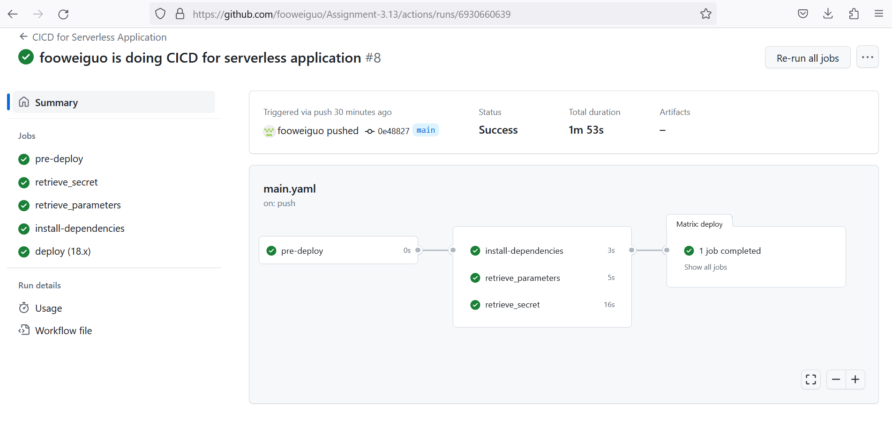

## Serverless Deploy with Secrets and Parameter Retrieval in CI-CD pipeline

First we initialise npm using 
```
npm init
```
and follow the instructions. In this case we call the software "assignment-313". Then we run

```
npm install -g serverless
```
to obtain the package.json and package-lock.json packages. To test deployment we can run:
```
serverless deploy
```
The CI-CD pipeline consists of the following workflows:

1. pre-deploy

2a. Get Secret Object

2b. Get Parameter Object

2c. Installing dependencies

3. Deployment

Tasks 2a, 2b, 2c depends on 1. Task 3 will depend on 2a, 2b, 2c. See image below.



# GitHub actions

## Pre-Amble

The following text will ensure that the GitHub action runs on push to the main branch. 

```
name: CICD for Serverless Application
run-name: ${{ github.actor }} is doing CICD for serverless application

on:
  push:
    branches: [ main, "*"]

```

## Jobs

### Job 1: Pre-Deploy
For the pre-deploy, 
```
jobs:
  pre-deploy:
    runs-on: ubuntu-latest
    steps:
      - run: echo "🎉 The job was automatically triggered by a ${{ github.event_name }} event"
      - run: echo "🐧 This job is now running on a ${{ runner.os }} server hosted by GitHub!"
      - run: echo "🔎 The name of your branch is ${{ github.ref }} and your repository is ${{ github.repository }}."
```

### Jobs 2a, 2b, 2c:
Next for tasks 2, we have for retrieve_secrets:

```
 retrieve_secret:
    runs-on: ubuntu-latest
    needs: pre-deploy
    steps:
      - name: Configure AWS Credentials
        uses: aws-actions/configure-aws-credentials@v2
        with:
          aws-access-key-id: ${{ secrets.AWS_ACCESS_KEY_ID }}
          aws-secret-access-key: ${{ secrets.AWS_SECRET_ACCESS_KEY }}
          aws-region: us-east-1

      # Firstly, insert your secrets in AWS Secret Manager
      # Then, you can retrieve the secrets based on your secret-id
      # If you have multiple secret key and value pairs like mine, you can parse
      # the entire json object and print the values you'd like to display/use

      - name: Get Secret Object
        run: |
          secret_object=$(aws secretsmanager get-secret-value --secret-id prod/appAlpha/weiguo --query SecretString --output json)

          # Parse specific keys from the secret object
          secret_value_hobby=$(echo "$secret_object" | jq -r '. | fromjson | .weiguo_hobby')
          secret_value_food=$(echo "$secret_object" | jq -r '. | fromjson | .weiguo_favourite')
          secret_value_loc=$(echo "$secret_object" | jq -r '. | fromjson | .weiguo_drinks')

          echo "Secret value Hobby is: $secret_value_hobby"
          echo "Secret value Favourite is: $secret_value_food"
          echo "Secret value Drinks is: $secret_value_loc"
```

To retrieve the parameters

```
  retrieve_parameters:
    runs-on: ubuntu-latest
    needs: pre-deploy
    steps:
      - name: Configure AWS Credentials
        uses: aws-actions/configure-aws-credentials@v2
        with:
          aws-access-key-id: ${{ secrets.AWS_ACCESS_KEY_ID }}
          aws-secret-access-key: ${{ secrets.AWS_SECRET_ACCESS_KEY }}
          aws-region: us-east-1

      # Firstly, insert your parameter in AWS Systems Manager > Parameter Store
      # Then, you can retrieve the parameters using aws ssm get-parameter command

      - name: Get parameter object
        run: |
          weiguo_height=$(aws ssm get-parameter --name weiguo_height --query Parameter.Value --output text)
          echo "Wei Guo's height is: $weiguo_height meters." 

          weiguo_phone=$(aws ssm get-parameter --name weiguo_phone --query Parameter.Value --output text)
          echo "Wei Guo's phone is: $weiguo_phone" 
```

and to install dependencies

```
  install-dependencies:
    runs-on: ubuntu-latest
    needs: pre-deploy
    steps:
      - name: Check out repository code
        uses: actions/checkout@v3
      - name: Run Installation of Dependencies Commands
        run: npm install
```

### Job 3
Finally to deploy

```
  deploy:
    name: deploy
    runs-on: ubuntu-latest
    needs: [install-dependencies, retrieve_secret, retrieve_parameters]
    strategy:
      matrix:
        node-version: [18.x]
    steps:
    - uses: actions/checkout@v3
    - name: Use Node.js ${{ matrix.node-version }}
      uses: actions/setup-node@v3
      with:
        node-version: ${{ matrix.node-version }}
    - run: npm ci
    - name: serverless deploy
      uses: serverless/github-action@v3.2
      with:
        args: deploy
      env:
        AWS_ACCESS_KEY_ID: ${{ secrets.AWS_ACCESS_KEY_ID }}
        AWS_SECRET_ACCESS_KEY: ${{ secrets.AWS_SECRET_ACCESS_KEY }}

```